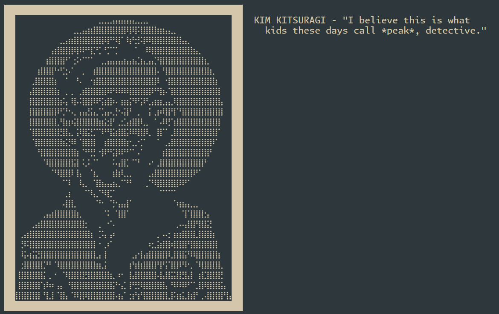

# kimsay
###### Kind of like cowsay, but waaaay more disco.
Kimsay is a command line utility written in c++ that does more or less the same as cowsay, but is Disco Elysium themed.

_What is Disco Elysium you say?_  
If you are asking questions like that one do yourself a favour and go play it. It is a game. A great game.

## Installation and usage
Kimsay is installed by simply running the `install.sh` script in the project's root.

The script compiles the source file using `c++` and moves the binary into `/usr/bin/`.
Other program files are put into `/usr/share/kimsay/`. If you are on mac, they are moved to `/usr/local/bin/` and `/usr/local/share/kimsay/` instead.

_The program should probably default to `/usr/games/` instead, but that would require adding it to the PATH and I don't want to deal with all of that at the moment. Installation will be reworked with a makefile soon enough anyways._

A manpage is also created, but basic usage is similar to cowsay:
- Using it argument-less makes the program read from standard input and uses that as text.
- If arguments are passed they are joined, separated by a single space, and used as the text.
- With the `-r` (as in _Revachol_) option, the text is taken from a collection of lines actually said in-game by Kim. Beware of spoilers.

There are some other options to customize the program's looks, check the manpage!
## Acknowledgements and disclaimers
Two single-header libraries are used by the project:
- [Nlohmann's JSON library](https://github.com/nlohmann/json)
- [Philsquared's Textflow](https://github.com/catchorg/textflowcpp/)

Many thanks for their work ^^.

_All of Disco Elysium's dialog lines and the original art of the portraits, as well as the characters depicted in said art, are property of their respective owners and authors._