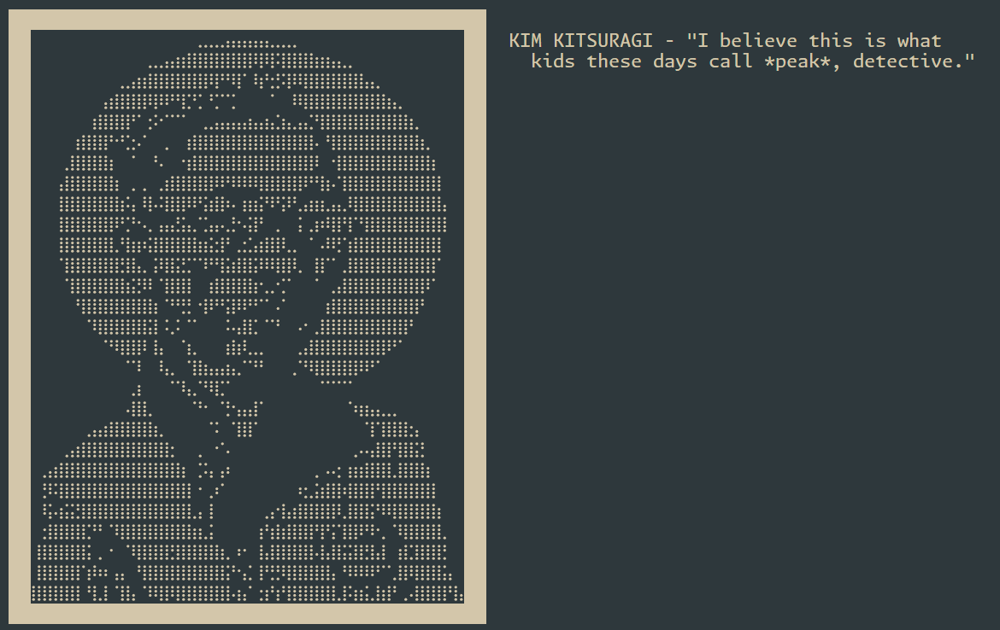

# kimsay
###### Kind of like cowsay, but waaaay more disco.
Kimsay is a command line utility written in c++ that does more or less the same as cowsay, but is Disco Elysium themed.

_What is Disco Elysium you say?_  
If you are asking questions like that one do yourself a favour and go play it. It is a game. A great game.

## Installation
There are two main ways of installing kimsay:
- `sudo make install` will install for all users.
	- The binary will be put into `/usr/local/bin`
	- Other program files are put into `/usr/local/share/kimsay`
	- The manpage is put into `/usr/local/share/man/man6`
- `make install PREFIX=~/.local` will install for your user only.
	- The binary will be put into `~/.local/bin`. Make sure this is in your path if you choose this method
	- Other program files are put into `~/.local/share/kimsay`
	- The manpage is put into `~/.local/share/man/man6`

You can further refine the installation by overriding `BINDIR` (path to the executable), `DATADIR` (path to the portraits and dialog) and `MANDIR` (path to the manpage).

_The binary path should probably default to `/usr/local/games/` instead, but that would require adding it to the PATH during installation and I don't want to deal with all of that at the moment._
## Usage
If no arguments are provided, the program reads from standard input until EOF. Otherwise it concatenates the provided arguments, separated by a space.

| Flag | Default | Description | Example |
| --- | --- | --- | --- |
| -h | | Prints a help message and nothing else | `kimsay -h` |
| -r | | _As in Revachol._ The text printed is random in-game dialog said by the character, beware of spoilers. Other text sources are ignored | `kimsay -r` |
| -F | | The portrait is painted frameless | `kimsay -F` |
| -u | | The text is printed without the disco format | `kimsay -u` |
| -c | kim | Instead of Kim, use the portrait and name of another character | `kimsay -c conceptualization` |
| -w | 42 | The text is wrapped at this amount of columns. Values under 12 are ignored | `kimsay -w 30` |
| -g | 2 | The amount of columns that separate the portrait from the text. Values under 0 are ignored | `kimsay -g 5` |
| -W | 2 | The amount of columns in the left and right of the image frame. Values under 1 are ignored | `kimsay -W 4` |
| -H | 1 | The amount of rows in the top and bottom of the image frame. Values under 1 are ignored | `kimsay -H 3` |
| -b | █ | The character to use in the image frame. Characters after the first are ignored | `kimsay -b #` |
| -n |  | Override the name of the character | `kimsay -n "Finn the Human"` |
| -f |  | The path to a custom file to use as portrait | `kimsay -f ./ascii/deer` |

### Characters

	
List of available characters

	<ul>
		<li>Default:</li>
		<ul>
			<li>kim</li>
		</ul>
		<li>Skills - Intellect:</li>
		<ul>
			<li>conceptualization</li>
			<li>drama</li>
			<li>encyclopedia</li>
			<li>logic</li>
			<li>rhetoric</li>
			<li>visualCalculus</li>
		</ul>
		<li>Skills - Psyche:</li>
		<ul>
			<li>authority</li>
			<li>empathy</li>
			<li>espritDeCorps</li>
			<li>inlandEmpire</li>
			<li>suggestion</li>
			<li>volition</li>
		</ul>
		<li>Skills - Physique:</li>
		<ul>
			<li>electrochemistry</li>
			<li>endurance</li>
			<li>halfLight</li>
			<li>painThreshold</li>
			<li>physicalInstrument</li>
			<li>shivers</li>
		</ul>
		<li>Skills - Motorics:</li>
		<ul>
			<li>composure</li>
			<li>handEyeCoordination</li>
			<li>interfacing</li>
			<li>perception</li>
			<li>reactionSpeed</li>
			<li>savoirFaire</li>
		</ul>
		<li>Characters:</li>
		<ul>
			<li>harry</li>
			<li>cuno</li>
			<li>joyce</li>
			<li>klaasje</li>
			<li>titus</li>
			<li>deserter</li>
			<li>garte</li>
			<li>lena</li>
			<li>noid</li>
			<li>soona</li>
			<li>jean</li>
			<li>idiot</li>
			<li>acele</li>
			<li>steban</li>
			<li>andre</li>
			<li>measurehead</li>
			<li>sunday</li>
			<li>roy</li>
			<li>plaisance</li>
			<li>warship</li>
			<li>eggHead</li>
			<li>dicemaker</li>
			<li>gary</li>
			<li>rene</li>
			<li>lilienne</li>
			<li>cunoesse</li>
			<li>morell</li>
			<li>cindy</li>
			<li>manana</li>
			<li>dolores</li>
			<li>gaston</li>
			<li>workerWoman</li>
			<li>richGuy</li>
			<li>annette</li>
			<li>trant</li>
			<li>washerWoman</li>
			<li>hanged</li>
			<li>ruby</li>
			<li>racistDriver</li>
			<li>tommy</li>
			<li>siileng</li>
			<li>smoker</li>
			<li>alain</li>
			<li>eugene</li>
			<li>echoMaker</li>
			<li>kortenaer</li>
			<li>phasmid</li>
			<li>paledriver</li>
			<li>jules</li>
			<li>notJean</li>
			<li>elisabeth</li>
			<li>tiago</li>
			<li>frittte</li>
			<li>scabLead</li>
			<li>shanky</li>
			<li>leo</li>
			<li>brain</li>
			<li>eyes</li>
			<li>judit</li>
			<li>sylvie</li>
			<li>gardener</li>
			<li>rosemary</li>
			<li>glen</li>
			<li>limbic</li>
			<li>yvonne</li>
			<li>cleaning</li>
			<li>babe</li>
			<li>horseFace</li>
			<li>lily</li>
			<li>pissF</li>
			<li>pigs</li>
			<li>fuckWorld</li>
			<li>twin</li>
			<li>mirror</li>
			<li>nix</li>
			<li>sleeper</li>
			<li>mack</li>
			<li>abigail</li>
			<li>kinema</li>
			<li>waterLock</li>
			<li>angus</li>
			<li>chester</li>
			<li>goracy</li>
			<li>theo</li>
			<li>realEstate</li>
			<li>dePaule</li>
			<li>library</li>
			<li>cunoDad</li>
			<li>ruud</li>
		</ul>
	</ul>

## Acknowledgements and disclaimers
Two single-header libraries are used by the project:
- [Nlohmann's JSON library](https://github.com/nlohmann/json)
- [Philsquared's Textflow](https://github.com/catchorg/textflowcpp/)

Special thanks to scribegoat for their **amazing** [Disco-Elysium-Scribe](https://disco-elysium-scribe.pages.dev/), it made it possible to get the lines said by Kim, and it is an overall great tool, also very pretty :)

Many thanks to all of them for their work ^^.

_All of Disco Elysium's dialog lines and the original art of the portraits, as well as the characters depicted in said art, are property of their respective owners and authors._